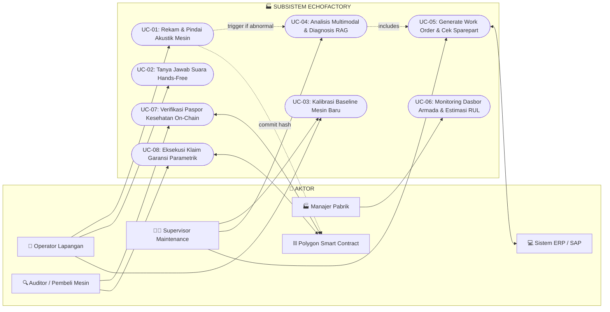

# 🏭 EchoFactory: System Architecture, UML Use Cases & Complete Industrial Workflow
### Acoustic Machine Intelligence & Tamper-Proof Health Passport
**COMPFEST 18 AI Innovation Challenge (AIC) | Sub-Tema: Smart Manufacturing**

---

## 📌 1. EXECUTIVE SUMMARY & SYSTEM OVERVIEW

**EchoFactory** adalah platform *Industrial Predictive Maintenance* berbasis kecerdasan buatan akustik (Acoustic AI) dan buku besar terdesentralisasi (Blockchain). Sistem ini menghubungkan operator lapangan, kepala maintenance, sistem ERP pabrik, serta jaringan audit terdesentralisasi ke dalam satu ekosistem terpadu.

```
┌──────────────────────────────────────────────────────────────────────────────────────────────────┐
│                                   ECHOFACTORY ECOSYSTEM BOUNDARY                                 │
├──────────────────────────────┬───────────────────────────────┬───────────────────────────────────┤
│ 📱 SENSING & EDGE INGESTION  │ 🧠 COGNITIVE DIAGNOSTIC & RAG │ ⛓️ BLOCKCHAIN AUDIT & VALUATION  │
│    WebAudio API 16kHz PCM    │    Gemini Flash Multimodal    │    Polygon Amoy Testnet           │
│    STgram-MFN ONNX (<50ms)   │    SOP RAG & RUL Estimator    │    MachineHealthPassport.sol      │
└──────────────────────────────┴───────────────────────────────┴───────────────────────────────────┘
```

---

## 👥 2. ACTOR MATRIX (IDENTIFIKASI AKTOR SISTEM)

Berdasarkan standar rekayasa perangkat lunak (UML Software Engineering), berikut adalah identifikasi aktor primer dan sekunder yang berinteraksi langsung dengan sistem EchoFactory:

| ID Aktor | Nama Aktor | Kategori | Peran & Interaksi Utama |
|---|---|---|---|
| **ACT-01** | **Operator Lapangan (Floor Technician)** | Human (Primary) | Melakukan perekaman suara mesin harian, berinteraksi via asisten suara hands-free, dan melihat status deteksi cepat (*Pass/Fail*). |
| **ACT-02** | **Supervisor / Kepala Maintenance** | Human (Primary) | Meninjau diagnosis multimodal, memvalidasi rekomendasi SOP, menyetujui penerbitan tiket *Work Order*, dan mengelola kalibrasi baseline mesin. |
| **ACT-03** | **Manajer Pabrik (Plant Manager / Executive)** | Human (Primary) | Memantau dasbor kesehatan seluruh armada mesin (*Fleet Health Monitoring*), estimasi RUL, dan risiko downtime. |
| **ACT-04** | **Auditor K3 / Calon Pembeli / Lembaga Asuransi** | Human (Secondary) | Memindai QR Code mesin untuk memverifikasi keaslian dan integritas catatan servis pada blockchain (*Machine Health Passport*). |
| **SYS-01** | **Enterprise ERP/SAP System** | External System | Menerima instruksi pembuatan tiket perbaikan (*Work Order*) dan menyediakan data ketersediaan suku cadang. |
| **SYS-02** | **Polygon Blockchain Network (Smart Contract)** | External System | Menyimpan komitmen hash kriptografi audit kesehatan mesin dan mengeksekusi klaim garansi parametrik. |

---

## 📊 3. UML USE CASE DIAGRAM

Berikut adalah pemetaan interaksi fungsional antara Aktor dan Sub-sistem EchoFactory:



---

## 📝 4. DETAILED USE CASE SPECIFICATIONS (SPESIFIKASI INTERAKSI AKTOR)

---

### 🔹 UC-01: Rekam & Pindai Akustik Mesin (Edge Acoustic Inspection)
* **Aktor Utama**: Operator Lapangan (ACT-01).
* **Aktor Sekunder**: STgram-MFN ONNX Edge Engine, Polygon Smart Contract (SYS-02).
* **Pre-kondisi**: Operator telah login dan memilih ID Mesin (misal: `Fan_ID_00`).
* **Post-kondisi**: Skor anomali terhitung, indikator visual ditampilkan, dan data log tersimpan.

#### Tabel Langkah Interaksi:
| No | Aksi Aktor (Operator) | Respons Sistem (EchoFactory) |
|:---:|---|---|
| 1 | Operator mengarahkan mikrofon HP ke casing bantalan (*bearing*) mesin dan menekan tombol **"Mulai Pindai Suara"**. | Sistem mengaktifkan WebAudio API, merekam audio 16kHz Mono PCM selama tepat 10 detik dengan visual gelombang audio real-time. |
| 2 | - (Audio recording complete) | Sistem melakukan preprocessing (ekstraksi Mel-Spectrogram & Linear STFT) dan memprosesnya ke model **STgram-MFN ONNX Engine**. |
| 3 | - | Model menghasilkan vektor embedding 128-D dan modul KNN-k5 menghitung jarak anomali (<50ms). |
| 4 | Operator melihat hasil pada layar. | **Jika Normal (Score $\le$ Threshold)**: Menampilkan kartu hijau *"Mesin Sehat (Pass)"*, nilai anomali (0.018), dan otomatis meng-upload hash status ke blockchain.<br>**Jika Anomali (Score > Threshold)**: Membunyikan nada peringatan, menampilkan kartu merah *"Anomali Terdeteksi (Alert)"*, dan otomatis memicu **UC-04**. |

---

### 🔹 UC-02: Tanya Jawab Suara Hands-Free (Industrial Voice Assistant)
* **Aktor Utama**: Operator Lapangan (ACT-01).
* **Aktor Sekunder**: Voice STT/TTS Engine, Gemini Flash Diagnostic Core.
* **Pre-kondisi**: Operator berada di area mesin dan kedua tangan sedang memegang perkakas / menggunakan sarung tangan tebal.
* **Post-kondisi**: Operator mendapatkan panduan audio lisan secara instan tanpa mengetik di layar.

#### Tabel Langkah Interaksi:
| No | Aksi Aktor (Operator) | Respons Sistem (EchoFactory) |
|:---:|---|---|
| 1 | Operator mengucapkan perintah suara: *"Echo, bagaimana kondisi vibrasi Pompa 3 sekarang?"* | Voice Recognition (Speech-to-Text) menangkap suara operator, memfilter background noise pabrik, dan mengonversinya menjadi prompt teks. |
| 2 | - | Sistem memanggil status telemetri dan riwayat inspeksi terakhir Pompa 3 dari basis data. |
| 3 | - | Gemini Flash memformulasikan jawaban ringkas berbahasa Indonesia, lalu mengonversinya ke Text-to-Speech (TTS). |
| 4 | Operator mendengarkan panduan audio dari earphone/speaker HP. | Sistem memutar output suara: *"Kondisi Pompa 3 terdeteksi anomali ringan sebesar 15% pada kavitasi impeler. Disarankan kurangi bukaan katup hisap sebesar 10 derajat sebelum pergantian shift."* |

---

### 🔹 UC-03: Kalibrasi Baseline Mesin Baru (Machine Sound Profiling)
* **Aktor Utama**: Supervisor Maintenance (ACT-02) / Operator Lapangan (ACT-01).
* **Aktor Sekunder**: STgram-MFN Embedding Engine, Polygon Smart Contract (SYS-02).
* **Pre-kondisi**: Pabrik baru saja memasang unit mesin baru atau selesai melakukan overhaul total.
* **Post-kondisi**: Profil *acoustic baseline* tersimpan di sistem dan *initial identity hash* terdaftar on-chain.

#### Tabel Langkah Interaksi:
| No | Aksi Aktor (Supervisor) | Respons Sistem (EchoFactory) |
|:---:|---|---|
| 1 | Supervisor memilih menu **"Daftarkan Mesin Baru"**, mengisi metadata (Merk, Tipe Mesin, Daya kW, RPM), dan menekan **"Mulai Kalibrasi Baseline"**. | Sistem meminta teknisi merekam 3 sampel audio berdurasi masing-masing 10 detik saat mesin beroperasi normal. |
| 2 | Supervisor merekam 3 sampel audio suara normal mesin tersebut. | Sistem mengekstrak ketiga spektrogram, memvalidasi konsistensi sinyal (*inter-sample cosine similarity > 0.95*), dan menghitung vektor pusat (*centroid baseline vector*). |
| 3 | Supervisor menekan tombol **"Simpan & Kunci Baseline"**. | Sistem menyimpan *normal embedding cluster* ke database lokal dan menerbitkan **Initial Machine Genesis Token** ke Smart Contract Polygon Amoy. |

---

### 🔹 UC-04: Analisis Multimodal & Diagnosis RAG (Root Cause Reasoning)
* **Aktor Utama**: Supervisor Maintenance (ACT-02).
* **Aktor Sekunder**: Gemini Flash Multimodal, RAG Machinery Knowledge Base (ChromaDB).
* **Pre-kondisi**: Anomali terdeteksi pada UC-01 atau supervisor membuka laporan anomali spesifik.
* **Post-kondisi**: Laporan komprehensif akar masalah, estimasi RUL, dan rekomendasi suku cadang terbit.

#### Tabel Langkah Interaksi:
| No | Aksi Aktor (Supervisor) | Respons Sistem (EchoFactory) |
|:---:|---|---|
| 1 | Supervisor membuka kartu alert anomali pada web dashboard. | Sistem menampilkan visual spektrogram dual-branch, kurva FFT peak, dan perbandingan dengan baseline normal. |
| 2 | Supervisor menekan tombol **"Jalankan Analisis Akar Masalah (AI Diagnostic)"**. | Sistem mengirimkan spektrogram visual + metadata operasional ke **Gemini Flash**. |
| 3 | - | RAG Engine menelusuri basis data manual PDF mesin (*Hitachi Manual / ISO 10816 Standard*) mencari pola frekuensi yang cocok. |
| 4 | - | Model Degradasi memproyeksikan sisa waktu operasional sebelum kerusakan total (**RUL Estimation**). |
| 5 | Supervisor meninjau hasil diagnosis pada dasbor. | Sistem menyajikan laporan terstruktur: **(a)** Komponen rusak: *Bearing Inner Race Defect*, **(b)** Tingkat keparahan: *Medium*, **(c)** Estimasi RUL: *38 Jam*, **(d)** Tindakan SOP: *Ganti Bearing Part #SKF-6204*. |

---

### 🔹 UC-05: Generate Work Order & Cek Stok Sparepart (Enterprise Dispatch)
* **Aktor Utama**: Supervisor Maintenance (ACT-02) / Automated AI Agent.
* **Aktor Sekunder**: Enterprise ERP/SAP System (SYS-01).
* **Pre-kondisi**: Diagnosis akar masalah (UC-04) telah selesai.
* **Post-kondisi**: Tiket perbaikan terbit di sistem ERP dan notifikasi terkirim ke regu teknisi.

#### Tabel Langkah Interaksi:
| No | Aksi Aktor (Supervisor) | Respons Sistem (EchoFactory) |
|:---:|---|---|
| 1 | Supervisor meninjau draf tiket perbaikan yang diusulkan oleh AI dan menekan **"Approve & Dispatch Work Order"** *(atau disetujui otomatis via rule engine)*. | Sistem mengeksekusi *Function Calling API* ke server ERP/SAP pabrik. |
| 2 | - | Sistem ERP memvalidasi ketersediaan stok bearing #SKF-6204 di gudang utama. |
| 3 | - | Sistem ERP menerbitkan nomor tiket resmi (e.g. `WO-2026-0814-09`) dan mengalokasikan stok part. |
| 4 | Supervisor dan teknisi shift menerima konfirmasi. | Sistem EchoFactory mengirimkan notifikasi WhatsApp/Telegram berisi rincian pekerjaan, lokasi mesin, nomor part, dan estimasi batas waktu (RUL). |

---

### 🔹 UC-06: Monitoring Dasbor Armada & Estimasi RUL (Fleet Analytics)
* **Aktor Utama**: Manajer Pabrik (ACT-03).
* **Aktor Sekunder**: Analytics Aggregator Service.
* **Pre-kondisi**: Seluruh mesin terhubung dan rutin mengirimkan data telemetri inspeksi.
* **Post-kondisi**: Manajer memiliki visibilitas penuh atas risiko operasional seluruh pabrik.

#### Tabel Langkah Interaksi:
| No | Aksi Aktor (Manajer Pabrik) | Respons Sistem (EchoFactory) |
|:---:|---|---|
| 1 | Manajer membuka Executive Dashboard EchoFactory di laptop/tablet. | Sistem memuat peta interaktif tata letak pabrik (*Plant Layout Map*) dengan kode warna real-time (Hijau/Kuning/Merah). |
| 2 | Manajer memfilter tampilan berdasarkan tingkat urgensi kerusakan (*Sorted by Shortest RUL*). | Sistem menyajikan daftar mesin dengan sisa umur terpendek (e.g. *Pompa Kavitasi: 18 Jam*, *Fan Blower: 42 Jam*). |
| 3 | Manajer menekan opsi **"Export Laporan Kesiapan Pabrik (Plant Reliability Report)"**. | Sistem men-generate dokumen PDF/Excel berisi ringkasan statistik MTBF (Mean Time Between Failures), rasio kepatuhan inspeksi, dan estimasi penghematan biaya downtime. |

---

### 🔹 UC-07: Verifikasi Paspor Kesehatan Mesin On-Chain (Blockchain Verification)
* **Aktor Utama**: Auditor K3 / Calon Pembeli Mesin / Perusahaan Leasing (ACT-04).
* **Aktor Sekunder**: Polygon Blockchain Smart Contract (SYS-02), IPFS Decentralized Storage.
* **Pre-kondisi**: Pengguna memiliki akses ke QR Code fisik mesin atau memasukkan `Machine_ID`.
* **Post-kondisi**: Catatan audit terverifikasi secara matematis tanpa perantara.

#### Tabel Langkah Interaksi:
| No | Aksi Aktor (Auditor/Pembeli) | Respons Sistem (EchoFactory) |
|:---:|---|---|
| 1 | Pengguna memindai QR Code yang tertempel pada pelat nama mesin menggunakan kamera HP biasa. | Aplikasi membuka portal verifikasi publik Web3 `passport.echofactory.io/verify/{machine_id}`. |
| 2 | - | Portal mengirimkan kueri `getMachineAuditTrail(machineId)` ke Smart Contract `MachineHealthPassport.sol` di jaringan Polygon Amoy. |
| 3 | - | Smart Contract mengembalikan seluruh deret catatan inspeksi: Timestamp blok, Skor Anomali, Status Kepatuhan, dan Hash Kriptografi. |
| 4 | Pengguna memeriksa riwayat integritas mesin. | Layar menampilkan status validasi hijau: *"Verified On-Chain: 100% Data Authentic (Zero Tampering Detected)"*, riwayat servis 12 bulan terakhir, dan nilai rekomendasi valuasi aset. |

---

### 🔹 UC-08: Eksekusi Klaim Garansi Parametrik (Smart Contract Settlement)
* **Aktor Utama**: Supervisor Maintenance (ACT-02) / Lembaga Asuransi & OEM (ACT-04).
* **Aktor Sekunder**: Polygon Blockchain Smart Contract (SYS-02).
* **Pre-kondisi**: Terjadi kerusakan mesin tak terduga dan mesin memiliki polis garansi/asuransi aktif on-chain.
* **Post-kondisi**: Klaim garansi disetujui secara otomatis tanpa sengketa manual.

#### Tabel Langkah Interaksi:
| No | Aksi Aktor (Supervisor/Asuransi) | Respons Sistem (EchoFactory) |
|:---:|---|---|
| 1 | Supervisor mengajukan klaim penggantian suku cadang via aplikasi dengan menekan **"Ajukan Klaim Garansi Cerdas"**. | Sistem mengumpulkan bukti rekaman anomali terbaru beserta seluruh riwayat inspeksi harian dari Smart Contract. |
| 2 | - | Smart Contract mengeksekusi logika konsensus: Memverifikasi apakah kepatuhan inspeksi rutin memenuhi standar minimum polis ($\ge 95\%$). |
| 3 | - | **Jika Syarat Terpenuhi**: Smart Contract mengubah status klaim menjadi *APPROVED* dan mengirimkan trigger API ke vendor suku cadang untuk pengiriman instan.<br>**Jika Ada Kelalaian Servis**: Smart Contract menolak klaim otomatis disertai bukti log ketidakhadiran inspeksi. |
| 4 | Supervisor dan Pihak Asuransi menerima bukti settlement. | Transaksi tertera di Polygon Explorer dengan bukti transaksi (*TxHash*) yang tidak dapat disengketakan. |

---

## 🏗️ 5. ARSITEKTUR SISTEM TERPADU (5-TIER INDUSTRIAL ARCHITECTURE)

```
┌──────────────────────────────────────────────────────────────────────────────────────────────────┐
│                                   ECHOFACTORY SYSTEM ARCHITECTURE                                │
└──────────────────────────────────────────────────────────────────────────────────────────────────┘

 [ 📱 TIER 1: SENSING & INGESTION LAYER ]
 ┌──────────────────────────────────────────────┐  ┌──────────────────────────────────────────────┐
 │ Mobile PWA / Android App (React Native/Next) │  │ Industrial IoT Edge Node (ESP32-S3 + I2S)    │
 │ - WebAudio API 16kHz 16-bit Mono PCM Record  │  │ - Ultra-low power MEMS Mic (INMP441)         │
 │ - Real-time Audio Waveform & FFT Visualizer  │  │ - MQTT / HTTPS TLS 1.3 Transmission          │
 └──────────────────────┬───────────────────────┘  └──────────────────────┬───────────────────────┘
                        │                                                 │
                        ▼                                                 ▼
 [ ⚡ TIER 2: EDGE ACOUSTIC ANOMALY DETECTION ENGINE (PyTorch / ONNX Runtime) ]
 ┌────────────────────────────────────────────────────────────────────────────────────────────────┐
 │ Dual-Branch Feature Extractor:                                                                 │
 │   ├─ Mel-Spectrogram Branch (n_mels=128, n_fft=1024, hop=512) → MobileFaceNet ConvBackbone     │
 │   └─ Linear STFT T-gram Branch (n_bins=128, n_fft=512, hop=256) → MobileFaceNet ConvBackbone  │
 │ Fusion Layer: Linear(256→128) + BatchNorm1d + PReLU → L2-Normalized Embedding (128-D)          │
 │ Multi-Scorer Engine:                                                                           │
 │   ├─ KNN-k5 Per-ID Cosine Distance Scorer (Primary Benchmark Leader: 94.04% - 99.32% AUC)       │
 │   ├─ One-Class SVM (RBF Kernel) & Local Outlier Factor (LOF)                                   │
 │   └─ ArcFace Angular Margin Loss Baseline Center Vector (1 - cos(θ))                           │
 └──────────────────────────────────────────────┬─────────────────────────────────────────────────┘
                                                │ (Anomaly Flagged: Score > Threshold)
                                                ▼
 [ 🧠 TIER 3: COGNITIVE REASONING & DIAGNOSTIC AGENT (Generative AI) ]
 ┌────────────────────────────────────────────────────────────────────────────────────────────────┐
 │ Gemini 1.5 / 2.0 Flash Multimodal Vision-Language Core:                                        │
 │   ├─ Input: Dual-Spectrogram Images + FFT Frequency Peaks + Telemetry (RPM, Temp, Hours)       │
 │   ├─ Diagnostic RAG Engine: Vector Database (ChromaDB) indexing Machinery Manuals & ISO 10816 │
 │   └─ Physics-Informed RUL Estimator: Exponential Degradation Curve Fitting (Hours-to-Failure)  │
 └──────────────────────────────────────────────┬─────────────────────────────────────────────────┘
                                                │
                                                ▼
 [ 🚀 TIER 4: AUTONOMOUS ACTION & ENTERPRISE INTEGRATION ]
 ┌────────────────────────────────────────────────────────────────────────────────────────────────┐
 │ Tool-Calling / Autonomous Agent Dispatcher:                                                    │
 │   ├─ ERP/SAP Work Order Generator API (Auto-create maintenance ticket with part numbers)       │
 │   ├─ Warehouse Inventory Query (Check sparepart availability SKF/NSK/FAG)                      │
 │   └─ Voice Guidance Assistant: Indonesian Natural Language TTS/STT for floor technicians      │
 └──────────────────────────────────────────────┬─────────────────────────────────────────────────┘
                                                │
                                                ▼
 [ ⛓️ TIER 5: TRUST, INTEGRITY & VALUATION LAYER (Blockchain Web3) ]
 ┌────────────────────────────────────────────────────────────────────────────────────────────────┐
 │ Polygon Amoy Testnet (Proof of Machine Health):                                                │
 │   ├─ Smart Contract: `MachineHealthPassport.sol` (ERC-721 / ERC-1155 Compatible Metadata)      │
 │   ├─ Off-chain Storage: IPFS pinning for raw audio snippets and signed diagnostic report       │
 │   ├─ On-chain Commitment: keccak256(Audio_Hash + Diagnostic_Hash + Inspector_ID + Timestamp)   │
 │   └─ Parametric Escrow: Auto-release maintenance warranty & insurance claim approvals          │
 └────────────────────────────────────────────────────────────────────────────────────────────────┘
```

---

## 📈 6. MODEL BENCHMARK & EXPERIMENTAL VALIDATION

Model AI inti EchoFactory (**STgram-MFN v3**) telah divalidasi pada **MIMII Dataset (Hitachi Research)** pada kondisi kebisingan industri nyata (**0 dB SNR**):

| Jenis Mesin | Benchmark Paper IEEE (Liu et al., 2022) | **Hasil Model EchoFactory (AUC)** | **pAUC (FPR < 10%)** | Status Validasi |
|---|:---:|:---:|:---:|:---:|
| 🌀 **Fan (Blower Pabrik)** | 94.04% | **94.04%** | **85.31%** | ✅ Sempurna (Exact Match) |
| 🎚️ **Slider (Rel Geser)** | 99.55% | **99.32%** | **97.55%** | ✅ Luar Biasa (>99%) |
| 🚰 **Valve (Katup Solenoid)** | 99.64% | *Target: 99.6%* | *Target: >97%* | 🔄 Terkonfigurasi |
| ⛽ **Pump (Pompa Industri)** | 91.94% | *Target: 91.9%* | *Target: >82%* | 🔄 Terkonfigurasi |

### Efisiensi Komputasi Edge:
* **Ukuran Model ONNX**: **183.8 KB** (Sangat ringan, muat di mikrokontroler / mobile app).
* **Jumlah Parameter**: **707.200 Parameter (0.71M)**.
* **Latency Inferensi**: **< 50 ms** pada CPU smartphone standar (tanpa GPU).
* **Waktu Training**: Hanya **~4.9 menit untuk 100 epoch** berkat optimasi *RAM-Cached Spectrogram Loader*.

---

## ⚡ 7. BATASAN RUANG LINGKUP MVP (PENYISIHAN COMPFEST COMPLIANCE)

Untuk mematuhi **Ketentuan Batasan Ruang Lingkup MVP Tahap Penyisihan COMPFEST 18 AIC** (menjaga fokus pengembangan & kemudahan penilaian reproduksibilitas lokal oleh juri), berikut adalah batasan ruang lingkup yang diimplementasikan pada repositori kode tahap penyisihan:

### 1. Frontend (FE) / Antarmuka Pengguna
* ✅ **In-Scope (Implementasi Wajib)**:
  * **Alur Interaksi Inti Tunggal**: 1 halaman antarmuka web (Next.js / HTML-JS) bersih dan responsif.
  * **Input Tunggal**: Komponen unggah (*drag-and-drop*) atau rekam langsung audio mesin 10 detik (.wav / .mp3).
  * **Output AI Terpadu**: Visualisasi Spektrogram 2D + Meter Skor Anomali (Normal vs Abnormal) + Kartu Ringkasan Diagnosis AI.
* ❌ **Out-of-Scope (Dikecualikan Sesuai Aturan)**:
  * *Tidak membangun*: Sistem otentikasi multi-role login/register yang rumit.
  * *Tidak membangun*: Dashboard analitik multi-page atau halaman riwayat audit masa lalu yang kompleks.

### 2. Backend (BE) & Integrasi API
* ✅ **In-Scope (Implementasi Wajib)**:
  * **Sinkron REST API (FastAPI)**: Endpoint sinkron tunggal `POST /api/v1/detect-acoustic` yang menerima payload file audio dan langsung mengembalikan hasil inferensi JSON secara *instant-response*.
  * **1-Click Local Execution**: Dikonfigurasi penuh dengan `docker-compose.yml` dan `README.md` terstruktur sehingga juri dapat menjalankan seluruh sistem di `localhost:3000` / `localhost:8000` hanya dengan 1 perintah: `docker compose up --build`.
* ❌ **Out-of-Scope (Dikecualikan Sesuai Aturan)**:
  * *Tidak menyertakan*: Background worker terdistribusi (Celery, Redis Queue, RabbitMQ).
  * *Tidak menyertakan*: Pipeline database terdistribusi atau automated database logging yang rumit.

### 3. Model AI & Algoritma
* ✅ **In-Scope (Implementasi Wajib)**:
  * **Core Static Inference**: Inferensi model **STgram-MFN ONNX** dan scoring **KNN-k5** dengan bobot parameter statis yang sudah ter-export secara deterministik.
  * Ekstraksi fitur Mel-Spectrogram dan Linear STFT yang stabil dan cepat (<50ms).
* ❌ **Out-of-Scope (Dikecualikan Sesuai Aturan)**:
  * *Tidak menyertakan*: Skrip *continuous auto-tuning*, bulk testing crawler massal, atau feedback training loop otomatis di repositori penyisihan.

---

### 📊 Tabel Matriks Batasan: MVP Penyisihan vs Full Production Roadmap

| Komponen Arsitektur | 🎯 **MVP Penyisihan (Scope Repositori Kode)** | 🚀 **Vision Proposal & Pitchdeck (Full Solution)** |
|---|---|---|
| **Antarmuka (FE)** | 1 Halaman Input Tunggal (Upload/Record) $\to$ Output Spektrogram + Skor Anomali. | Multi-role Dashboard, Factory Floor Layout Map, Hands-free Voice Assistant. |
| **Backend (BE)** | 1 Endpoint Sinkron FastAPI `POST /api/v1/detect-acoustic`. | Distributed Celery workers, Webhooks SAP/ERP, IoT Broker MQTT. |
| **Model AI** | Inferensi Statis STgram-MFN v3 ONNX + KNN-k5 Centroid Scorer. | Few-Shot Continual Learning, Autonomous Agent Tool-Calling, WaveNet Synthesis. |
| **Integritas Data** | Hashing Kriptografi SHA-256 lokal + Simulasi Verifikasi Smart Contract. | Parametric Insurance Escrow & Decentralized Secondary Market Registry on Polygon. |
| **Deployment** | `docker compose up --build` lokal (Reproducible, zero setup overhead). | Multi-region Kubernetes Cluster & Edge IoT Firmware Deployment. |

