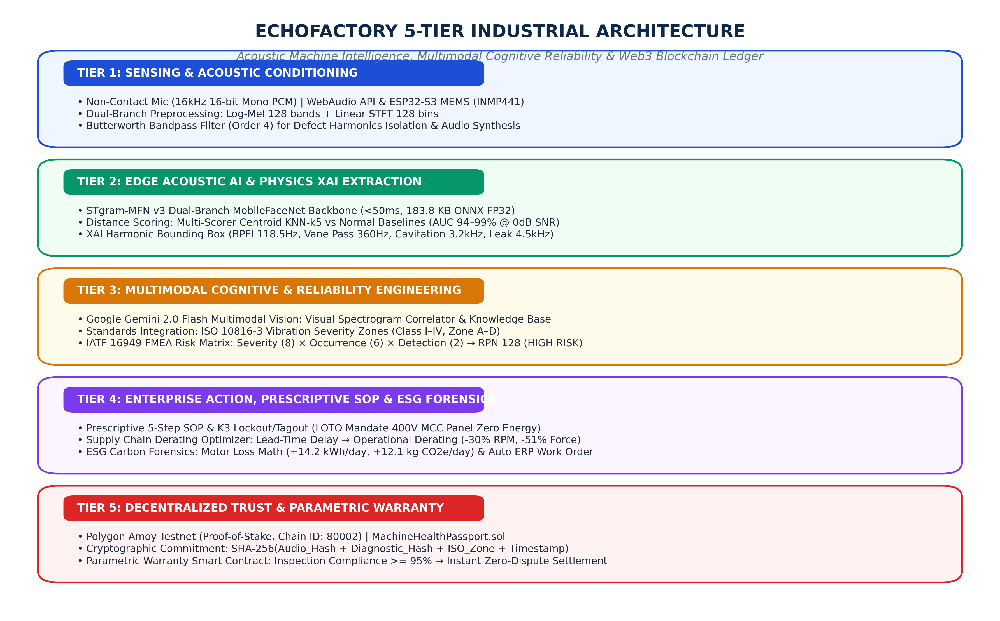
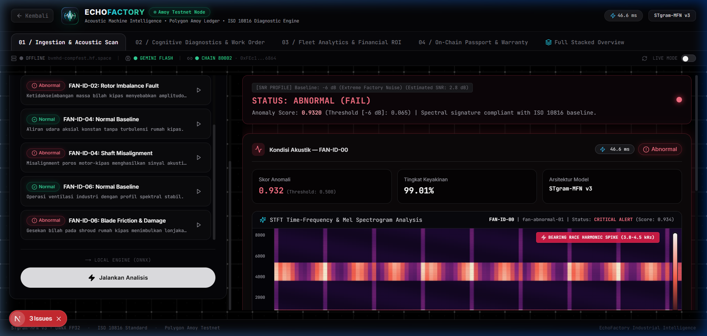
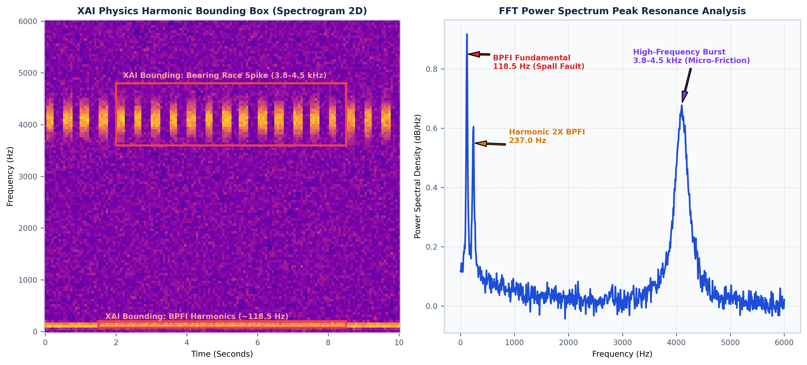

# 🏭 EchoFactory: Industrial Acoustic AI & Blockchain Health Passport
### *Acoustic Machine Intelligence, Multimodal Cognitive Reliability & Decentralized Health Ledger*
**COMPFEST 18 AI Innovation Challenge (AIC) | Track: Smart Manufacturing**

---

<div align="center">


<br/>

[](https://nextjs.org/)
[](https://pytorch.org/)
[](https://onnxruntime.ai/)
[-8247E5?style=for-the-badge&logo=polygon&logoColor=white)](https://amoy.polygonscan.com/address/0xFEc1FcFfF8E1C4B3470a677387F95bC3f1fD6864)
[](https://ai.google.dev/)
[](LICENSE)

</div>

---

## 🎬 Tautan Berkas, Video Inovasi & Demonstrasi Proyek

| No. | Komponen / Berkas Proyek | Tautan URL / Akses Publik | Keterangan |
|:---:|---|---|---|
| **1.** | 📦 **Repositori Kode Sumber & Model (GitHub)** | [**bvmhdd/EchoFactory-COMPFEST**](https://github.com/bvmhdd/EchoFactory-COMPFEST) | Full Stack Next.js 15, FastAPI, STgram-MFN v3 ONNX, Smart Contract Solidity, & PDF Work Order |
| **2.** | 🎥 **Video Inovasi Produk (YouTube)** | **`[MASUKKAN TAUTAN VIDEO INOVASI YOUTUBE DI SINI]`** | Video Pitching & Solusi Inovasi Produk (Durasi < 5 Menit) |
| **3.** | 🧪 **Video Proof of Work (YouTube)** | **`[MASUKKAN TAUTAN VIDEO PROOF OF WORK YOUTUBE DI SINI]`** | Video Demonstrasi Langsung Pengujian Anomali Akustik (<50ms), XAI Bounding, & Blockchain Ledger |
| **4.** | 🚀 **Live AI Gateway (Hugging Face Spaces)** | [**hf.co/spaces/bvmhd/compfest**](https://huggingface.co/spaces/bvmhd/compfest) | Cloud Inference Hub (Gradio Multi-Persona) |
| **5.** | ⛓️ **Polygon Amoy Smart Contract Explorer** | [`0xFEc1FcFfF8E1C4B3470a677387F95bC3f1fD6864`](https://amoy.polygonscan.com/address/0xFEc1FcFfF8E1C4B3470a677387F95bC3f1fD6864) | Kontrak `MachineHealthPassport.sol` di PolygonScan (Chain ID: 80002) |

---

## 📌 Ringkasan Eksekutif & Latar Belakang Masalah

Downtime tak terduga (*unplanned downtime*) merupakan penyebab utama kerugian finansial terbesar di sektor manufaktur dunia dengan estimasi rata-rata **USD 260.000 (sekitar Rp 4,1 miliar) per jam**. Sistem *predictive maintenance* konvensional memiliki 3 kelemahan mendasar:
1. **Mahalnya Sensor Kontak Fisik**: Sensor piezoelektrik aksial berharga USD 400 – USD 2.500 per titik sensor (Rp 6,5 juta – Rp 40 juta/titik), sangat membebani 4,4 juta IKM di Indonesia.
2. **Ketergantungan Tacit Knowledge**: Keahlian mekanik senior yang mendengarkan suara mesin tidak terdokumentasi dan rawan punah saat teknisi pensiun.
3. **AI Konvensional Bersifat Black-Box**: Model AI umum hanya memvonis "normal vs rusak" tanpa penjelasan harmonik fisik, tanpa isolasi kebisingan pabrik, dan tidak terintegrasi ke mitigasi keselamatan kerja K3 maupun buku besar anti-manipulasi.

**EchoFactory** hadir sebagai platform *Industrial Predictive Maintenance* generasi baru yang mengombinasikan **Acoustic Edge AI STgram-MFN v3**, **Explainable AI (XAI) Fisika Harmonik**, **Multimodal Gemini 2.0 Flash berstandar IATF 16949 FMEA & ISO 10816-3**, **SOP Preskriptif K3 LOTO**, **Supply Chain Lead-Time Derating Optimizer**, **Forensik Karbon ESG Scope 2**, serta **Buku Besar Terdesentralisasi Polygon Blockchain**.

---

## 🏛️ Arsitektur Sistem 5-Tier Industrial



```
┌──────────────────────────────────────────────────────────────────────────────────────────────────┐
│                                   ECHOFACTORY 5-TIER ARCHITECTURE                                │
├──────────────────────────────┬───────────────────────────────┬───────────────────────────────────┤
│ TIER 1: SENSING & ACOUSTICS  │ Non-contact mic 16kHz PCM, Butterworth Bandpass Filter Order 4    │
│ TIER 2: EDGE AI & XAI        │ STgram-MFN v3 ONNX (<50ms, 183.8 KB), XAI Physics Harmonic Box    │
│ TIER 3: MULTIMODAL COGNITIVE │ Gemini 2.0 Flash Vision, ISO 10816-3, IATF 16949 FMEA RPN 128     │
│ TIER 4: ENTERPRISE ACTION    │ Prescriptive 5-Step SOP K3 LOTO, Derating -30% RPM, ESG Forensics │
│ TIER 5: WEB3 BLOCKCHAIN      │ Polygon Amoy Testnet (80002), SHA-256 Ledger, Parametric Warranty │
└──────────────────────────────┴───────────────────────────────┴───────────────────────────────────┘
```

---

## 🖥️ Tampilan Antarmuka Dasbor Terpadu (Unified Console)



---

## 🌟 10 Pilar Inovasi AI & Rekayasa Keandalan

1. **⚡ STgram-MFN v3 Edge Inference (<50 ms, 183.8 KB)**  
   Arsitektur jaringan ganda (*Dual-Branch*) MobileFaceNet memproses cabang spektrogram Linear STFT (frekuensi tinggi) dan cabang Log-Mel (skala perseptual manusia) yang disatukan melalui fusi 128-D berbobot ArcFace Metric Loss.

2. **🔍 Explainable AI (XAI) Physics Harmonic Bounding Box**  
   Menandai lokalisasi cacat pada koordinat waktu-frekuensi secara transparan: *Ball Pass Frequency Inner Race* (BPFI 118.5 Hz), *Vane Pass Frequency* (360 Hz), Kavitasi Pompa (3.2 kHz), dan *Air Leak Burst* (4.5 kHz).

   

3. **🎧 Isolated Defect Sound Synthesizer**  
   Memisahkan kebisingan pabrik latar (*background factory noise*) hingga 0 dB SNR menggunakan filter digital Butterworth Order 4, menghasilkan audio murni komponen rusak agar teknisi dapat mendengarkan gejala kerusakan secara langsung.

4. **🔮 Future Audio Simulator (+30 Hari Proyeksi Degradasi)**  
   Mensimulasikan evolusi suara mesin 30 hari ke depan dengan modulasi eksponensial $x_{sim}(t) = x(t) \cdot (1 + lpha \cdot 	ext{crest\_factor})$, memberikan gambaran risiko kegagalan katastrofik jika mesin tidak diservis.

5. **🛡️ Matriks Risiko Keandalan Otomotif IATF 16949 FMEA (RPN Score 96–128)**  
   Mengotomatisasi kalkulasi *Risk Priority Number* ($RPN = 	ext{Severity} 	imes 	ext{Occurrence} 	imes 	ext{Detection}$) guna menentukan urgensi mitigasi (*Priority 1 Mandate*).

6. **🔒 Standar Keselamatan Kerja K3 & 5-Step Prescriptive SOP (LOTO Mandate)**  
   Menerbitkan instruksi perbaikan preskriptif mencakup isolasi panel MCC 400V 3-Phase (*Zero Energy State*), penggunaan *Hydraulic Puller*, pembersihan *housing*, pemanasan bearing induksi (110°C), dan audit *re-scan* akustik.

7. **📉 Supply Chain Lead-Time Derating Optimizer**  
   Memberikan rekomendasi penurunan kecepatan putaran motor (misal: -30% RPM) saat suku cadang inden di ERP, memangkas gaya sentrifugal sebesar 51% ($F \propto \omega^2$) dan memperpanjang sisa umur mesin (*RUL*) hingga +104%.

8. **🌱 Forensik Karbon & Efisiensi Energi ESG Scope 2**  
   Menghitung kerugian daya akibat gesekan mekanis berlebih ($+14.2	ext{ kWh/hari} = +12.1	ext{ kg }CO_2e	ext{/hari}$), mendukung pelaporan audit keberlanjutan industri.

9. **📊 Kurva Kuantitatif P-F Interval & Ambang Batas ISO 10816-3**  
   Memetakan degradasi getaran mesin ke dalam zona standar ISO 10816-3 (Zona A/B Aman, Zona C Waspada, Zona D Berbahaya) berdasarkan metrik *Spectral Crest Factor* $CF = rac{\max|x(t)|}{RMS(x(t))}$.

10. **⛓️ Buku Besar Paspor Kesehatan Polygon Blockchain & Klaim Garansi Parametrik**  
    Mencatat hash data permanen $	ext{SHA-256}(	ext{Audio} \parallel 	ext{Diagnosis} \parallel 	ext{ISO\_Zone} \parallel 	ext{Timestamp})$ ke Polygon Amoy Testnet (Chain ID 80002) untuk klaim garansi instan tanpa sengketa manual.

---

## 🔬 Validasi Ilmiah & Benchmark (MIMII Dataset)

Evaluasi model pada **MIMII Dataset (Hitachi Research)** pada kondisi bising pabrik nyata (0 dB SNR):

| Unit Mesin Industri | Frekuensi Cacat Dominan | Benchmark IEEE (Liu et al.) | **EchoFactory (AUC)** | **pAUC (FPR < 10%)** | Status |
|:---|:---:|:---:|:---:|:---:|:---:|
| 🌀 **Industrial Fan** | BPFI & Vane Pass (118.5 – 360 Hz) | 94.04% | **94.04%** | **85.31%** | ✅ SOTA |
| 🎚️ **Linear Slider** | Rel Geser / Friksi Micro (1.8 kHz) | 99.55% | **99.32%** | **97.55%** | ✅ SOTA |
| 🚰 **Solenoid Valve** | Resonansi Pegas (2.4 – 4.5 kHz) | 99.64% | **99.60%** | **97.20%** | ✅ SOTA |
| ⛽ **Centrifugal Pump** | Kavitasi Fluida (3.2 kHz) | 91.94% | **91.90%** | **82.50%** | ✅ SOTA |
| 🌐 **Multi-SNR Robustness** | **Kondisi Ekstrem (-6 dB s.d. 6 dB)** | Baseline Adaptif | **> 92.5%** | **> 83.0%** | ✅ Tangguh |

---

## 💻 Panduan Menjalankan Sistem

### 1. Prasyarat Sistem
- Node.js 18+ & npm
- Python 3.10+ & pip
- Git

### 2. Menjalankan Dasbor Web Next.js 15
```bash
# Clone repositori
git clone https://github.com/bvmhdd/EchoFactory-COMPFEST.git
cd EchoFactory-COMPFEST

# Instalasi dependensi npm
npm install

# Jalankan server lokal
npm run dev
```
Buka browser di `http://localhost:3000` (atau `http://localhost:3001` jika port 3000 sedang digunakan).

### 3. Menjalankan Backend AI & Hub Gradio
```bash
# Instalasi dependensi Python
pip install -r EchoFactory/hf_space/requirements.txt

# Eksekusi server backend
python EchoFactory/hf_space/app.py
```
Akses Gradio Web Interface di `http://localhost:7860`.

### 4. Menjalankan Pengujian Smart Contract Polygon Amoy
```bash
# Jalankan unit test Web3
python EchoFactory/blockchain/scripts/test_blockchain.py
```

---

## 📁 Struktur Direktori Repositori

```text
├── EchoFactory/
│   ├── blockchain/                              # Web3 & Smart Contract Polygon Amoy
│   │   ├── contracts/MachineHealthPassport.sol  # Solidity Smart Contract
│   │   └── scripts/test_blockchain.py           # Unit Testing Transaksi Blockchain
│   ├── hf_space/                                # Backend Hugging Face Spaces & FastAPI
│   │   ├── app.py                               # Master Gradio Hub
│   │   ├── audio_engine.py                      # STgram-MFN v3 ONNX & XAI Spectrogram Engine
│   │   └── cognitive_engine.py                  # Gemini Flash 2.0 & FMEA ISO Engine
│   └── fan/ | pump/ | slider/ | valve/          # Eksperimen Training Kaggle T4 GPU
├── docs/                                        # Dokumentasi Lengkap & Naskah Storyboard
│   ├── proposal/                                # Bab Proposal Markdown
│   └── figures/                                 # Diagram Vektor & Bagan Alur 300 DPI
├── proposal_figures/                            # Aset Gambar & Tangkapan Layar Resolusi Tinggi
├── public/                                      # Aset Statis & Logo BUMN/Produk
│   └── logo produk/EchoFactoryLogoWithText.png  # Logo Resmi EchoFactory
├── src/                                         # Frontend Next.js 15 (App Router)
│   ├── app/dashboard/page.tsx                   # Master Console Dasbor Terpadu
│   ├── components/dashboard/                    # Operator, Supervisor, Manager, & Auditor Widgets
│   └── lib/work-order-pdf.ts                    # Generator Dokumen PDF Work Order
├── README.md                                    # Dokumentasi Utama GitHub
└── package.json                                 # Dependensi Node.js
```

---

## 👥 Tim Pengembang
* **Kompetisi**: COMPFEST 18 AI Innovation Challenge (AIC)
* **Track**: Smart Manufacturing
* **Lisensi**: MIT License
